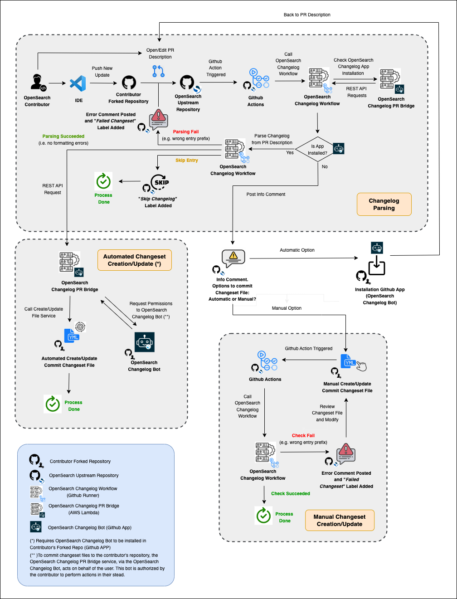
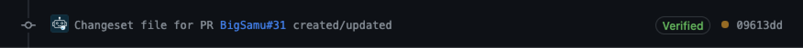
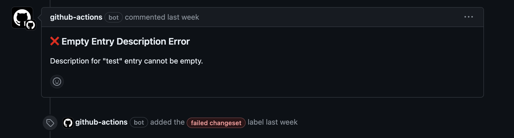
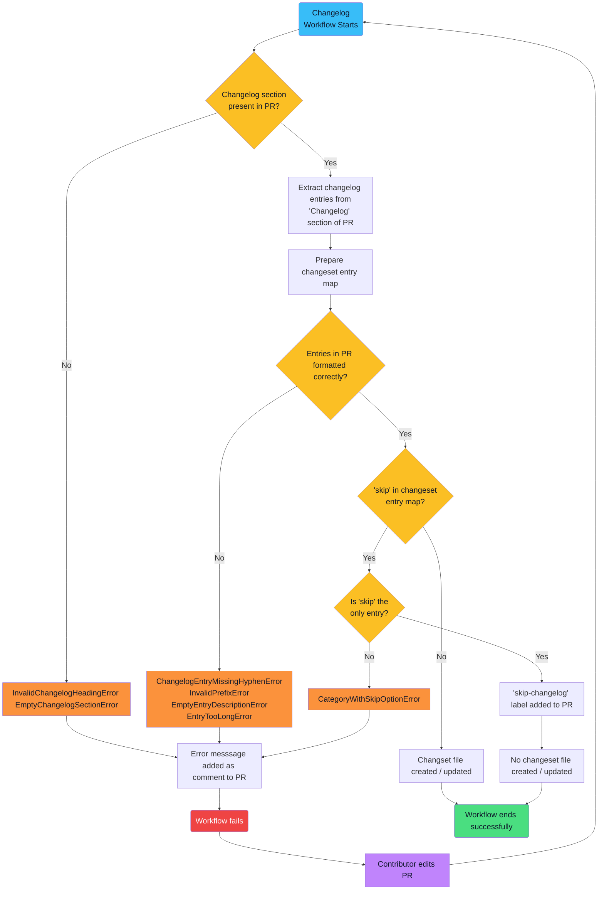

<a name="back-to-top"></a>

<!-- prettier-ignore-start -->
<!-- omit in toc -->
# OpenSearch Automated Changelog Workflow and Release Notes Process
<!-- prettier-ignore-end -->


<!--  -->

<!-- prettier-ignore-start -->
<!-- omit in toc -->
## Introduction
<!-- prettier-ignore-end -->

This repository contains the details and source code for a new broader **Automated Changelog and Release Notes Process** adopted by the [OpenSearch Project](https://opensearch.org/) community. It presents comprehensive information on how to set up this new procedure aimed at streamlining contributions for any OpenSearch repo, including also guidelines on how to contribute. For more details about it, please consult the sections below.

<!-- prettier-ignore-start -->
<!-- omit in toc -->
## Table of Contents
<!-- prettier-ignore-end -->

- [Background of Proposal](#background-of-proposal)
- [Current Context](#current-context)
- [Changesets](#changesets)
- [Process Overview](#process-overview)
  - [Changelog Workflow Process](#changelog-workflow-process)
    - [Changelog Process Entities](#changelog-process-entities)
    - [Changelog Process Jobs](#changelog-process-jobs)
  - [Release Notes Process](#release-notes-process)
- [Getting Started for OpenSearch Repository Maintainers](#getting-started-for-opensearch-repository-maintainers)
  - [Changelog Workflow Process](#changelog-workflow-process-1)
    - [Create a New `changelogs` Directory](#create-a-new-changelogs-directory)
    - [Add a "Changelog" Section to the PR Description Template](#add-a-changelog-section-to-the-pr-description-template)
    - [Add a Github Worflow File to Invoke OpenSearch Changelog Workflow](#add-a-github-worflow-file-to-invoke-opensearch-changelog-workflow)
  - [Release Notes Script Process](#release-notes-script-process)
- [Usage for OpenSearch Maintainers and Contributors](#usage-for-opensearch-maintainers-and-contributors)
  - [Changelog Workflow Process](#changelog-workflow-process-2)
    - [Automatic Apporach Folled](#automatic-apporach-folled)
    - [Manual Apporach Folled](#manual-apporach-folled)
  - [Release Notes Script Process](#release-notes-script-process-1)
    - [Using a GitHub Actions Workflow to Generate Changeset Files](#using-a-github-actions-workflow-to-generate-changeset-files)
  - [Release Notes Process](#release-notes-process-1)
    - [Workflow Flowchart](#workflow-flowchart)
  - [Release Notes Process](#release-notes-process-2)
- [Contributing](#contributing)
- [License](#license)
- [Need Help?](#need-help)

<p align="right">(<a href="#back-to-top">back to top</a>)</p>

## Background of Proposal

On March 20, 2023, Josh Romero issued a [call for proposals](https://github.com/opensearch-project/.github/issues/148) that would "solve the entire collection of issues around generating both ongoing changelogs and release notes during General Availability (GA) of the product, for all OpenSearch project repositories."

On May 4, 2023, a working group voted unanimously to move forward with the "Automation" variation of [Ashwin Chandran's proposal](https://github.com/opensearch-project/.github/issues/156). This proposal has now been implemented, and the details of the new changelog and release notes process are set out below.

<p align="right">(<a href="#back-to-top">back to top</a>)</p>

## Current Context

The **Automated Changelog and Release Notes Process** presented here improves both contributor experience as well as the efficiency of product development and the release of new versions for any OpenSeearch library.

Whenever a contributor opens a new PR, they are prompted to indicate whether or not they have manually added an entry to the CHANGELOG.md file. However, since any changelog entry entered requires a PR number as a reference, contributors had to open a PR first, grab its number, and then add a second commit to include these new changes.

In addition to the inefficiency above, this two-step process also creates an opportunity for merge conflicts. Suppose two or more contributors update the CHANGELOG.md file in their respective PRs, and updates are not synchronized. In that case, changelog entries may introduce error conflicts for the same prefix (i.e., `feat`) due to the order they are being added, requiring manual intervention to sort things out, which is tedious.

Furthermore, hurdles to speed up this procedure are also present in the case of new version distributions for any OpenSearch library. Whenever a new product version is scheduled for GA, release notes and changelog updates have to be prepared manually. This task is also time-consuming and labor-intensive.

Automating the changelog and release notes process resolves these complications, giving valuable time back to contributors and maintainers and improving the overall experience of working in OpenSearch's repositories without wasting time on laborious operative tasks.

<p align="right">(<a href="#back-to-top">back to top</a>)</p>

## Changesets

The **Automated Changelog and Release Notes Process** bases its logic in the use of **changeset** or **fragment** files. In the context of this automated solution, **changesets** are atomic pieces of information that store a collection of changelog entries detailing modifications done by a contributor in the source code. This information is stored in a `.yml` file for each PR and contains the following three bits of information:

- **Entry Prefix**: type of change proposed by the contributor. The available options are `breaking`,`chore`, `deprecate`, `doc`,`feat`,`fix`,`infra`,`refactor`,`security`,`test`, `skip`.
- **Entry Description**: detail regarding changes proposed by the contributor.
- **PR Number and Link**: pull request number identifier and GitHub link related to the set of changes in the contribution.

<p align="right">(<a href="#back-to-top">back to top</a>)</p>

## Process Overview

The **Automated Changelog and Release Notes Process** is comprised of two independent sets of separate sub-processes: (1) the **Changelog Workflow Process** and (2) the **Release Notes Script Process**.

### Changelog Workflow Process

The first sub-process is conformed by a [Github Action](https://docs.github.com/en/actions) using a [Reusable Workflow](https://docs.github.com/en/actions/using-workflows/reusing-workflows) that checks the validity of a newly added or edited changeset file. Two distinct approaches can be used for these checks: an automatic approach or a manual one.

For an automated approach, the workflow communicates with an external service ([OpenSearch Changelog PR Bridge](https://github.com/BigSamu/OpenSearch_Changeset_Bot)) that can automatically create these changeset files on a contributor's behalf and commit them to the open PR.

The following flow diagram depicts the entire **Changelog Workflow Process** from start to finish.



> **NOTE**: Currently the chnagelog process is enforcing an automatic approach. No manual approach is available yet.

#### Changelog Process Entities

As the diagram illustrates, the **Changelog Process** involves interaction between two **GitHub Repositories** (the OpenSearch repo and the contributor's forked repo), two **External Services** (a reusable GitHub Action and an Express.js application), and one **GitHub App**. These components work together differently depending on whether or not a contributor opts to install the App on its forked OpenSearch repo.

- **GitHub Repositories**

  - **OpenSearch Upstream Repository** → This is the base repository where a contributor's PR resides (e.g. [OpenSearch Dashboards](https://github.com/opensearch-project/OpenSearch-Dashboards), [OpenSearch UI Framework](https://github.com/opensearch-project/oui), [OpenSearch Neural Search](https://github.com/opensearch-project/neural-search), etc).
  - **Contributor Forked Repository** → The head repository from which the contributor's PR originates. It contains the changes the contributor suggests for a merge into the base repository.

- **External Services**

  - **OpenSearch Changelog Workflow** → GitHub Action implementing a reusable workflow that triggers whenever a PR is opened or edited. This workflow acts only in the **OpenSearch Upstream Repository** and carries out the following actions:

    - Check and parse contributor entries in the `## Changelog` section of the PR description.
    - Post comments and add or remove labels on PRs.
    - For an automatic changeset approach, it communicates with **OpenSearch** Changelog PR Bridge\*\* to create, update, or delete changeset files automatically.
    - For a manual changeset approach, it validates the content of a fragment file created or updated by a contributor.

  - **OpenSearch Changelog PR Bridge** → An Express.js application that serves as the authorized entity for committing changeset files on behalf of the contributor. Only available for an automatic approach for creating or updating fragment files.

    <!-- - If a contributor has [installed the bot](https://github.com/apps/opensearch-changeset-bot) in their forked repository, the PR bridge service will receive HTTP requests from the **OpenSearch Changelog Workflow** and commit a changeset file to the branch in the contributor's repository where the PR has originated from. The PR bridge service acts only in the **Contributor Forked Repository**.

    - If a contributor has not installed the bot, the PR bridge service will communicate back to the **OpenSearch Changelog Workflow**, instructing it to look for and parse a manually-created changeset file. -->

- **GitHub App**
  - **OpenSearch Changelog Bot** → a GitHub App required for a contributor to grant permissions to the **OpenSearch Changelog PR Bridge** service so the latter can act on his behalf.

   <!-- As mentioned above, the App is installed in the **Contributor Forked Repository** and acts only to creating or updating changeset files. The source code and documentation for the bot is available in the [GitHub App's repository](https://github.com/BigSamu/OpenSearch_Changeset_Bot). -->

<p align="right">(<a href="#back-to-top">back to top</a>)</p>

#### Changelog Process Jobs

As the diagram illustrates, the **Changelog Process** consists of three primary jobs:

- **Changelog Parsing** → Here, the reusable workflow checks first if the **OpenSearch Changelog Bot** App has been installed in the **Contributor Forked Repository**. If so, the service parses the `## Changelog` section of the open PR description. On the other hand, I=if the **OpenSearch Changelog Bot** App has not been set up, the contributor is prompted to either install the bot or manually commit a changeset file.

  If the automatic approach is followed, the parsing of the `## Changelog` section from the PR will result in one of the following three outputs:

  1. **Parsing Failed** → If one or more entries in the `## Changelog` section are formatted improperly, the process will post an error comment, and a `failed changeset` label will be added to the PR. Addtionaly any previous existent changeset file from that PR will be removed.
  2. **Parsing Succeeded** → If the entries in the `## Changelog` section are adequately formatted and the action succeeds in parsing them, then the **Automatic Changeset Creation/Update** job is initiated adn the chnagelog process continue.
  3. **Skip Entry** → If a contributor adds a `skip` entry (i.e. changes in base code do not require a changelog entry, for instance fixing a minor typographical error),  then no changeset file will be created or existing ones will be deleted. A `Skip-Changelog` label will be added to the PR, and the changelog process will end successfully.

- **Automatic Changeset Creation/Update** → This second job is initiated after the `## Changelog` section from the PR description is successfully parsed. In this job, the **OpenSearch Changelog PR Bridge** service receives a request from the **OpenSearch Changelog Workflow** for committing a changeset file in the **Contributor Forked Repository**. The former obtains the required permissions from the **OpenSearch Changelog Bot** when this is installed in the later repo, thus acting on behalf of the contributor.

- **Manual Changeset Creation/Update** → This third job is an alternative to the second one if the **OpenSearch Changelog Bot** App is not installed in the **Contributor Forked Repository**. The contributor must manually add or edit a fragment file in this case. After the contributor commits a fragment file, the **OpenSearch Changelog Workflow** will - on this occasion - check the formatting of the changeset file. In this case. wwo outcomes are possible here:

  1. **Check Failed**: If one or more entries in the fragment file are wrongly formatted, the process will post an error comment and a `failed changeset` label will be added to the PR.
  2. **Check Succeeded**: If the entries in the fragment file are correctly formatted, the changelog process will finish sucessfully.

<p align="right">(<a href="#back-to-top">back to top</a>)</p>


<!-- 1. Creating a new `changelogs` directory in the root folder of the repository.

1. Adding a "Changelog" section to the PR template, with instructions for how contributors can add valid changelog entries to this section.

2. Using a GitHub Actions workflow to extract entries from the "Changelog" section of each PR description, create or update a changeset file in `.yml` format, and add this file to the new `changelogs/fragments` directory. The generated changeset file is automatically included as part of the changes to be merged when the PR is approved. -->

### Release Notes Process


<!-- For the second sub-process, this repository also provides template files for a script that can be used to automatically update the release notes document when a new version is scheduled for release.

Implementing a script that, when manually triggered from the command line upon general availability of a new product version, will cull the `changelogs/fragments` directory for changeset files and use those files to populate the release notes for the new version and update the final changelog. -->

<p align="right">(<a href="#back-to-top">back to top</a>)</p>

## Getting Started for OpenSearch Repository Maintainers

This section discusses in greater detail the steps required by each **OpenSearch** repo to get its library ready to implement the processes described in the "[Process Overview](#process-overview)" section above.

### Changelog Workflow Process

#### Create a New `changelogs` Directory

To centralize information pertinent to the new changelog process, a new `changelogs` directory has to be added by maintainers at the root of any OpenSearch repository. This directory is the new location for `CHANGELOG.md`.

Also a subdirectory called `fragments` needs to be added in the parent folder `changelogs`. The later one is the one where all changeset files in `.yml` are being added automatically or manually when a PR is open. Remember that only one changeset file is required per PR. These changeset files are named with the PR number they correspond to. (E.g., `5218.yml`.)

Below is an example of how this directory looks like

```
├── ...
└── changelogs
  ├── CHANGELOG.md
  └── fragments
      ├── 5218.yml
      ├── 5219.yml
      └── 5220.yml
```

<p align="right">(<a href="#back-to-top">back to top</a>)</p>

#### Add a "Changelog" Section to the PR Description Template

The PR template has to be updated by adding a new "Changelog" section as follows:

```
...

## Changelog
<!--
Add each of the changelog entries as a line item in this section. e.g.
- fix: Updates the graph
- feat: Adds a new feature

If this change does not need to added to the changelog, just add a single `skip` line e.g.
- skip

Valid prefixes: breaking, chore, deprecate, doc, feat, fix, infra, refactor, test

Descriptions following the prefixes must be 50 characters or less
-->

...
```

The comment block in this section provides contributors with instructions for how to add properly-formatted changelog entries to their PR.

#### Add a Github Worflow File to Invoke OpenSearch Changelog Workflow

Under each `./github/workflow` directory create a file called `opensearch_changelog_workflow.yml` and add the following code below:

```yaml
name: OpenSearch Changelog Workflow

on:
  pull_request_target:
    types: [opened, edited]

permissions:
  contents: read
  issues: write
  pull-requests: write

jobs:
  update-changelog:
    runs-on: ubuntu-latest
    steps:
      - name: Check out repository
        uses: actions/checkout@v4
      - name: Parse changelog entries and submit request for changset creation
        uses: BigSamu/OpenSearch_Parse_Changelog_Action@main
        with:
          token: ${{secrets.GITHUB_TOKEN}}
```

Whenever a PR is opened or edited in an OpenSearch repository, this workflow will be triggered in the **OpenSearch Upstream Repository**. Metadata from the PR will be extracted and parsed or checked depending the approach a contributor want to follow (automatic or manual commit of changeset files).


### Release Notes Script Process


## Usage for OpenSearch Maintainers and Contributors

This section discusses how maintainers and contributors can use this new process in their daily days to take advantge of benefits the automatization implemented the creation of changelogs and release notes

### Changelog Workflow Process

To make use of the changelog workflow when opening a PR, a contributor or maintainer can follow either an automatic or manual approach for commiting changeset files.

#### Automatic Apporach Folled

In order to use the **OpenSearch Changelog PR Bridge** service for automatic commit of changeset files in any of your OpenSearch forked repos:

- Navigate to the [OpenSearch-bot](https://github.com/apps/opensearch-changeset-bot) installation page and click "Install".
- Follow the instructions there and only install this App in all forked OpenSearch repositories where you want to have this feature activated.

Once installed, go to the PR description and under the `## Changelog` section add the changelog entries detailing the changes suggested in your PR.

Below are the formatting standards for changelog entries in the `## Changelog`:

- Each entry line must begin with a hyphen (-) in the Markdown source file.
- Contributors must categorize their changes by using one of the following prefixes, followed by a colon.
  - `breaking`
  - `chore`
  - `deprecate`
  - `doc`
  - `feat`
  - `fix`
  - `infra`
  - `refactor`
  - `security`
  - `test`
- If the changes in a PR are minor (e.g., fixing a typo), contributors can enter `- skip` in the "Changelog" section to instruct the workflow not to generate a changeset file.
  - If `-skip` is entered in the "Changelog" section, no other categories or descriptions can be present.
- After the colon, contributors should provide a concise description of their changes. Descriptions must be 100 characters or less.

Below is an example of valid entries in the `## Changelog` section of the PR description:

```markdown
## Changelog

<!--
Add each of the changelog entries as a line item in this section. e.g.
- fix: Updates the graph
- feat: Adds a new feature

If this change does not need to added to the changelog, just add a single `skip` line e.g.
- skip

Valid prefixes: breaking, chore, deprecate, doc, feat, fix, infra, refactor, test

Descriptions following the prefixes must be 50 characters or less
-->

- feat: Adds a new feature
- refactor: Improves an existing feature
- test: Add unit testing to new feature
- test: Update unit testing for existing feature
```

Mantainers and contributors can add more than one entry if they are contributing to more than one type of PR prefix. Also, they do not need to delete the comment block in this section, although they can. If they leave the comment block, they should ensure that the changelog entries they add lie _outside_ of the comment block.

Once done adding the changelog entries and submitting the PR, the `OpenSearch Changelog Workflow` will run an create a changeset file as below in the `chagelog/fragments` directory

```yaml
feat:
  - Adds a new feature ([#532](https://github.com/.../pull/532))

refactor:
  - Improves an existing feature ([#532](https://github.com/.../pull/532))

test:
  - Add unit testing to new feature ([#532](https://github.com/.../pull/532))
  - Update unit testing for existing feature ([#532](https://github.com/.../pull/532))
```

And the following update will appear in the PR conversation history:



This changeset file will become part of the code that is merged when the PR is approved.

If the workflow encounters a `- skip` line in the PR, and there are no other changelog entries present, it will skip the creation of a changeset file, and the workflow will terminate successfully.


If the workflow encounters an error (e.g., an invalid changelog entry), it will fail, and a custom error message will be printed to the workflow logs and added as a comment to the open PR explaining the reason for the failure.



For the case of entries that will result in errors, you can check the examples below for reference:

```
// Including "skip" with another category
- skip
- feat: Adds a new feature
```

```
// Missing a hyphen
feat: Adds a new feature
```

```
// Invalid category prefix
- new: Adds something new
```

```
// Missing description
- feat
```

```
// Description longer than 50 characters
- feat: Adds a new feature that is simply too excellent to be described in 50 characters or less
```

#### Manual Apporach Folled


### Release Notes Script Process


<p align="right">(<a href="#back-to-top">back to top</a>)</p>

#### Using a GitHub Actions Workflow to Generate Changeset Files

Whenever a contributor opens a PR or edits an existing PR, a GitHub Actions workflow is triggered that extracts the metadata from the PR and checks what a contributor has entered in the "Changelog" section of the PR description.

If a contributor has entered valid changelog entries (see formatting requirements in previous section above), the workflow will categorize these entries and either create or update a `.yml` changeset file in the `changelogs/fragments` directory of the repository.

This changeset file will include changelog descriptions under their proper category and also add a link to the PR that generated these changes. Below is an example of what the contents of a changeset file will look like:

```yaml
feat:
  - Adds a new feature ([#532](https://github.com/.../pull/532))

refactor:
  - Improves an existing feature ([#532](https://github.com/.../pull/532))

test:
  - Add unit testing to new feature ([#532](https://github.com/.../pull/532))
  - Update unit testing for existing feature ([#532](https://github.com/.../pull/532))
```

This changeset file will become part of the code that is merged when the PR is approved.

If the workflow encounters a `- skip` line in the PR, and there are no other changelog entries present, it will skip the creation of a changeset file, and the workflow will terminate successfully.

If the workflow encounters an error (e.g., an empty "Changelog" section or an invalid changelog entry), it will fail, and a custom error message will be printed to the workflow logs and added as a comment to the open PR explaining the reason for the failure.

Contributors can then address the error and update their PR, which will trigger the workflow to run again.

### Release Notes Process


#### Workflow Flowchart

The following flow chart, built using [Mermaid](https://mermaid.js.org/) syntax, illustrates the logic this workflow follows.

(NOTE: If you are viewing this README in an IDE or code editor, the flow chart will not render. To view the chart, please visit this README file on GitHub's website, which includes built-in support for Mermaid syntax.)



<p align="right">(<a href="#back-to-top">back to top</a>)</p>

### Release Notes Process

[COMPLETE RILEY AND WILL]

When a new product release is ready for general availability, OpenSearch maintainers can run the following script command from the command line:

```bash
yarn release_note:generate
```

This command executes a script that performs the following actions:

- Extract information from the changeset files in the `changelogs/fragments` directory
- Map the changelog entries in these files to their appropriate changelog section headings
- Generate the changelog section for the new release and add it to the top of the changelog
- Create a release notes document to accompany the new release
- Del**ete the ch**angeset files from the `changelogs/fragments` directory

<p align="right">(<a href="#back-to-top">back to top</a>)</p>

## Contributing

The **Automated Changelog Release Notes Process** is the result of a concerted effort by OpenSearch maintainers and contributors to improve the development experience for all involved in OpenSearch suite.

Contributions to the **OpenSearch Changelog Workflow** and **OpenSearch **Release** Notes** services are welcome! See our [Developer Guide](./DEVELOPER_GUIDE.md) for instructions on how to set up the project in your local environment and [CONTRIBUTING.md](./CONTRIBUTING.md) for guidelines.

**NOTE:** Bear in mind that for suggestions or contributions to the **OpenSearch Changelog PR Bridge** service, a distinct [repository](https://github.com/BigSamu/OpenSearch_Changeset_Bot) is used.

<p align="right">(<a href="#back-to-top">back to top</a>)</p>

## License

This project is an open-source product released under the Apache 2.0 license (see either [the Apache site](https://www.apache.org/licenses/LICENSE-2.0) or the [LICENSE.txt file](./LICENSE.txt)). The Apache 2.0 license allows you to freely use, modify, distribute, and sell your own products that include Apache 2.0 licensed software.

## Need Help?
