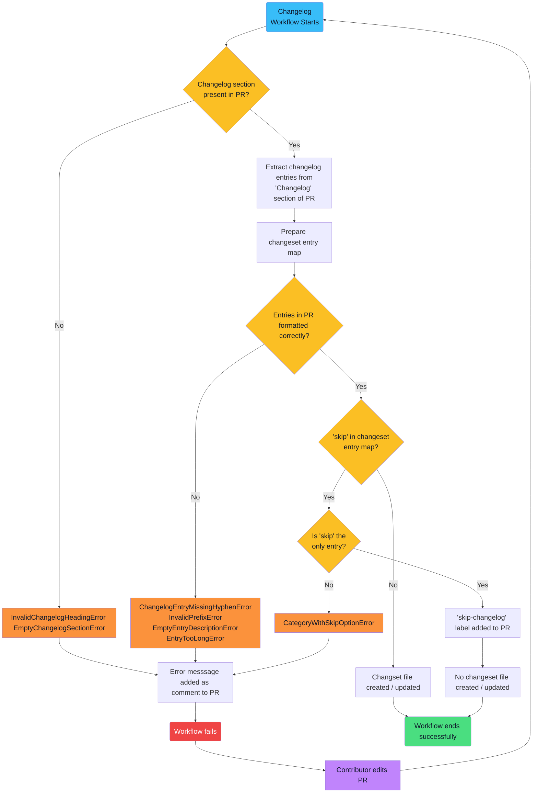

<!-- omit in toc -->
# OpenSearch Create Changeset Action


This GitHub Actions workflow automates the management of changelog entries for pull requests in OpenSearch repositories. It is part of a broader update to the changelog and release notes process, the details of which are available below.

<!-- omit in toc -->
# Revised Changelog and Release Notes Process

- [Introduction](#introduction)
- [Process Overview](#process-overview)
- [Benefits of the New Process](#benefits-of-the-new-process)
- [Process Details](#process-details)
  - [1. Creating a New `changelogs` Directory](#1-creating-a-new-changelogs-directory)
  - [2. Adding a "Changelog" Section to the PR Description Template](#2-adding-a-changelog-section-to-the-pr-description-template)
  - [3. Using a GitHub Actions Workflow to Generate Changeset Files](#3-using-a-github-actions-workflow-to-generate-changeset-files)
    - [Overview](#overview)
    - [Usage](#usage)
- [Workflow Details](#workflow-details)
- [Formatting Requirements](#formatting-requirements)
- [Workflow Flowchart](#workflow-flowchart)
    - [Workflow Flowchart](#workflow-flowchart-1)
  - [4. Implementing a Release Notes Generation Script](#4-implementing-a-release-notes-generation-script)
- [Conclusion](#conclusion)

## Introduction

On March 20, 2023, Josh Romero issued a [call for proposals](https://github.com/opensearch-project/.github/issues/148) that would "solve the entire collection of issues around generating both ongoing CHANGELOGs, and release notes during GA of the product, for all OpenSearch project repositories."

On May 4, 2023, a working group voted unanimously to move forward with the "Automation" variation of [Ashwin Chandran's proposal](https://github.com/opensearch-project/.github/issues/156). This proposal has now been implemented, and the details of the new changelog and release notes process are set out below.

## Process Overview

The updated changelog and release notes process involves four primary changes in the repository:

1. Creating a new `changelogs` directory in the root folder of the repository.

2. Adding a "Changelog" section to the PR template, with instructions for how contributors can add valid changelog entries to this section.

3. Using a GitHub Actions workflow to extract entries from the "Changelog" section of each PR description, create or update a changeset file in `.yml` format, and add this file to the new `changelogs/fragments` directory. The generated changeset file is automatically included as part of the changes to be merged when the PR is approved.

4. Implementing a script that, when manually triggered from the command line upon general availability of a new product version, will cull the `changelogs/fragments` directory for changeset files and use those files to populate the release notes for the new version and update the final changelog.

Details on each of these changes are available in the "[Process Details](#process-details)" section below.

## Benefits of the New Process

The new changelog and release notes process improves both contributor experience as well as the efficiency of product development and release.

Previously, when a contributor opened a PR, they would be prompted to indicate whether or not they had manually added an entry to the changelog. However, they could not add an entry to the changelog without having a PR number to reference.

This resulted in an inefficient two-step process, in which contributors had to (1) open a PR with their committed code and, once they had the PR number to reference in the changelog, (2) add an entry to the changelog, which then required pushing a new commit to their PR.

Additionally, when a new product version was scheduled for general availability release, release notes and changelog updates had to be prepared manually. This was a time-consuming process. Automating the generation of release notes and changelog entries streamlines this process and gives valuable time back to contributors and code maintainers, improving the overall experience of working in OpenSearch's repositories.

## Process Details

This section discusses in greater detail the four primary changes listed in the "[Process Overview](#process-overview)" section above.

### 1. Creating a New `changelogs` Directory

To centralize information pertinent to the new changelog process, a new `changelogs` directory has been added to the root of the repository. This directory is the new location for `CHANGELOG.md`.

It also houses the `fragments` subdirectory, which includes changeset files in `.yml` format that have been generated from merged PRs. (Only one changeset file is generated per PR.)

Changeset files are named with the PR number they correspond to. (E.g., `5218.yml`.)

### 2. Adding a "Changelog" Section to the PR Description Template

The PR template has been updated with a new "Changelog" section. The comment block in this section provides contributors with instructions for how to add properly-formatted changelog entries to their PR.

Below are the formatting standards for changelog entries:
- Each entry line must begin with a hyphen (-) in the Markdown source file.
- Contributors must categorize their changes by using one of the following prefixes, followed by a colon.
  - `breaking`
  - `chore`
  - `deprecate`
  - `doc`
  - `feat`
  - `fix`
  - `infra`
  - `refactor`
  - `security`
  - `test`
- If the changes in a PR are minor (e.g., fixing a typo), contributors can enter `- skip` in the "Changelog" section to instruct the workflow not to generate a changeset file.
  - If `-skip` is entered in the "Changelog" section, no other categories or descriptions can be present.
- After the colon, contributors should provide a concise description of their changes. Descriptions must be 50 characters or less.

Below is an example of a valid entry in the "Changelog" section of the PR description. (Contributors can add more than one entry if they are contributing more than one type of change in their PR. They do not need to delete the comment block in this section, although they can. If they leave the comment block, they should ensure that the changelog entries they add to their PR lie *outside* of the comment block.)

```markdown
## Changelog
<!-- Default comment block giving formatting instructions for changeloo entries -->

- feat: Adds a new feature
- refactor: Improves an existing feature
```

Below are examples of invalid entries:

```
// Including "skip" with another category
- skip
- feat: Adds a new feature
```
```
// Missing a hyphen
feat: Adds a new feature
```
```
// Invalid category prefix
- new: Adds something new
```
```
// Missing description
- feat
```
```
// Description longer than 50 characters
- feat: Adds a new feature that is simply too excellent to be described in 50 characters or less
```

### 3. Using a GitHub Actions Workflow to Generate Changeset Files

#### Overview

Whenever a contributor opens a PR or edits an existing PR, a GitHub Actions workflow is triggered that extracts the metadata from the PR and checks what a contributor has entered in the "Changelog" section of the PR description.

If a contributor has entered valid changelog entries (see formatting requirements in previous section above), the workflow will categorize these entries and either create or update a `.yml` changeset file in the `changelogs/fragments` directory of the repository.

This changeset file will include changelog descriptions under their proper category and also add a link to the PR that generated these changes. Below is an example of what the contents of a changeset file will look like:

```yaml
feat:
  - Adds a new feature ([#532](https://github.com/.../pull/532))

refactor:
  - Improves an existing feature ([#532](https://github.com/.../pull/532))

test:
  - Add unit testing to new feature ([#532](https://github.com/.../pull/532))
  - Update unit testing for existing feature ([#532](https://github.com/.../pull/532))
```

This changeset file will become part of the code that is merged when the PR is approved.

If the workflow encounters a `- skip` line in the PR, and there are no other changelog entries present, it will skip the creation of a changeset file, and the workflow will terminate successfully.

If the workflow encounters an error (e.g., an empty "Changelog" section or an invalid changelog entry), it will fail, and a custom error message will be printed to the workflow logs and added as a comment to the open PR explaining the reason for the failure.

Contributors can then address the error and update their PR, which will trigger the workflow to run again.

#### Usage

Here's an example of how to use this action in a workflow file:

```yaml
name: Create Change Set

on:
  pull_request:
    types: [synchronize, opened, edited]
    paths-ignore:
      - "changelogs/fragments/**/*"

jobs:
  update-changelog:
    runs-on: ubuntu-latest
    steps:
      - name: Check out repository
        uses: actions/checkout@v4
      - name: Update Changelog
        uses: BigSamu/OpenSearch_Change_Set_Create_Action@main
        with:
          token: ${{ secrets.GITHUB_TOKEN }}
          changeset_path: changelogs/fragments
```

## Workflow Details

Whenever a PR is opened or edited in an OpenSearch repository, this workflow is triggered.

The workflow extracts the metadata from the PR and checks what a contributor has entered in the "Changelog" section of the PR description.

If a contributor has entered valid changelog entries (see formatting requirements below), the workflow will categorize these entries and either create or update a `.yml` changeset file in the `changelogs/fragments` directory of the repository.

This changeset file will include changelog descriptions under their proper category and also add a link to the PR that generated these changes. Below is an example of what the contents of a changeset file will look like:

```yaml
feat:
  - Adds a new feature ([#532](https://github.com/.../pull/532))

refactor:
  - Improves an existing feature ([#532](https://github.com/.../pull/532))

test:
  - Add unit testing to new feature ([#532](https://github.com/.../pull/532))
  - Update unit testing for existing feature ([#532](https://github.com/.../pull/532))
```

This changeset file will become part of the code that is merged when the PR is approved.

If the workflow encounters an error, it will fail, and a custom error message will be printed to the workflow logs explaining the reason for the failure.

Contributors can then address the error and update their PR, which will trigger the workflow to run again.

## Formatting Requirements

In order for the workflow to successfully create or update a changeset file from a PR description, contributors will need to ensure that their entries in the "Changelog" section of the PR description adhere to the following formatting requirements:

- Each entry line must begin with a hyphen (-) in the Markdown source file.
- Contributors must categorize their changes by using one of the following prefixes, followed by a colon.
  - `breaking`
  - `chore`
  - `deprecate`
  - `doc`
  - `feat`
  - `fix`
  - `infra`
  - `refactor`
  - `test`
  - `security`
- If the changes in a PR are minor (e.g., fixing a typo), contributors can enter `- skip` in the "Changelog" section to instruct the workflow not to generate a changeset file.
  - If `-skip` is entered in the "Changelog" section, no other categories or descriptions can be present.
- After the colon, contributors should provide a concise description of their changes. Descriptions must be 50 characters or less.

Below is an example of a valid entry in the "Changelog" section of the PR description. (Contributors can add more than one entry if they are contributing more than one type of change in their PR.)

```
- feat: Adds a new feature
- refactor: Improves an existing feature
```

Below are examples of invalid entries:

```
// Including "skip" with another category
- skip
- feat: Adds a new feature
```

```
// Missing a hyphen
feat: Adds a new feature
```

```
// Invalid category prefix
- new: Adds something new
```

```
// Missing description
- feat
```

```
// Description longer than 50 characters
- feat: Adds a new feature that is simply too excellent to be described in 50 characters or less
```

## Workflow Flowchart

Below is a flowchart, built using [Mermaid](https://mermaid.js.org/) syntax, demonstrating the logic this workflow follows:
#### Workflow Flowchart

The following flow chart, built using [Mermaid](https://mermaid.js.org/) syntax, illustrates the logic this workflow follows.

(NOTE: If you are viewing this README in an IDE or code editor, the flow chart will not render. To view the chart, please visit this README file on GitHub's website, which includes built-in support for Mermaid syntax.)



### 4. Implementing a Release Notes Generation Script

When a new product release is ready for general availability, OpenSearch maintainers can run the following script command from the command line:

```bash
yarn release_note:generate
```
This command executes a script that performs the following actions:
- Extract information from the changeset files in the `changelogs/fragments` directory
- Map the changelog entries in these files to their appropriate changelog section headings
- Generate the changelog section for the new release and add it to the top of the changelog
- Create a release notes document to accompany the new release
- Delete the changeset files from the `changelogs/fragments` directory

## Conclusion

This automated process for generating changelog entries and release notes is the result of a concerted effort on the part of OpenSearch maintainers and contributors to improve the development experience for all involved. If you have any suggestions for how we might improve these process, please let us know!
