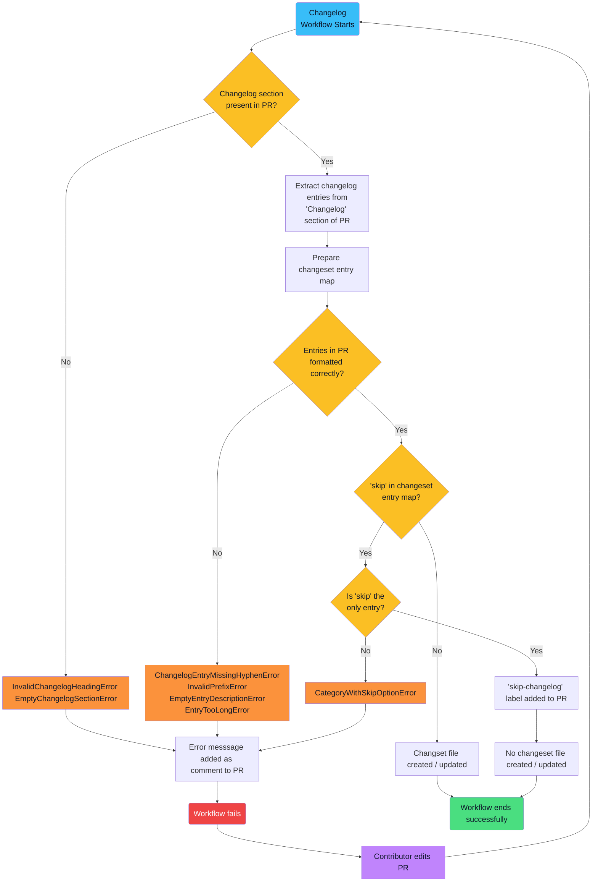

# OpenSearch Create Changeset Action


This GitHub Actions workflow automates the management of changelog entries for pull requests in OpenSearch repositories.

## Usage

Here's an example of how to use this action in a workflow file:

```yaml
name: Create Change Set

on:
  pull_request:
    types: [synchronize, opened, edited]
    paths-ignore:
      - "changelogs/fragments/**/*"

jobs:
  update-changelog:
    runs-on: ubuntu-latest
    steps:
      - name: Check out repository
        uses: actions/checkout@v4
      - name: Update Changelog
        uses: BigSamu/OpenSearch_Change_Set_Create_Action@main
        with:
          token: ${{ secrets.GITHUB_TOKEN }}
          changeset_path: changelogs/fragments
```

## Workflow Details

Whenever a PR is opened or edited in an OpenSearch repository, this workflow is triggered.

The workflow extracts the metadata from the PR and checks what a contributor has entered in the "Changelog" section of the PR description.

If a contributor has entered valid changelog entries (see formatting requirements below), the workflow will categorize these entries and either create or update a `.yml` changeset file in the `changelogs/fragments` directory of the repository.

This changeset file will include changelog descriptions under their proper category and also add a link to the PR that generated these changes. Below is an example of what the contents of a changeset file will look like:

```yaml
feat:
  - Adds a new feature ([#532](https://github.com/.../pull/532))

refactor:
  - Improves an existing feature ([#532](https://github.com/.../pull/532))

test:
  - Add unit testing to new feature ([#532](https://github.com/.../pull/532))
  - Update unit testing for existing feature ([#532](https://github.com/.../pull/532))
```

This changeset file will become part of the code that is merged when the PR is approved.

If the workflow encounters an error, it will fail, and a custom error message will be printed to the workflow logs explaining the reason for the failure.

Contributors can then address the error and update their PR, which will trigger the workflow to run again.

## Formatting Requirements

In order for the workflow to successfully create or update a changeset file from a PR description, contributors will need to ensure that their entries in the "Changelog" section of the PR description adhere to the following formatting requirements:

- Each entry line must begin with a hyphen (-) in the Markdown source file.
- Contributors must categorize their changes by using one of the following prefixes, followed by a colon.
  - `breaking`
  - `chore`
  - `deprecate`
  - `doc`
  - `feat`
  - `fix`
  - `infra`
  - `refactor`
  - `test`
  - `security`
- If the changes in a PR are minor (e.g., fixing a typo), contributors can enter `- skip` in the "Changelog" section to instruct the workflow not to generate a changeset file.
  - If `-skip` is entered in the "Changelog" section, no other categories or descriptions can be present.
- After the colon, contributors should provide a concise description of their changes. Descriptions must be 50 characters or less.

Below is an example of a valid entry in the "Changelog" section of the PR description. (Contributors can add more than one entry if they are contributing more than one type of change in their PR.)

```
- feat: Adds a new feature
- refactor: Improves an existing feature
```

Below are examples of invalid entries:

```
// Including "skip" with another category
- skip
- feat: Adds a new feature
```

```
// Missing a hyphen
feat: Adds a new feature
```

```
// Invalid category prefix
- new: Adds something new
```

```
// Missing description
- feat
```

```
// Description longer than 50 characters
- feat: Adds a new feature that is simply too excellent to be described in 50 characters or less
```

## Workflow Flowchart

Below is a flowchart, built using [Mermaid](https://mermaid.js.org/) syntax, demonstrating the logic this workflow follows:


