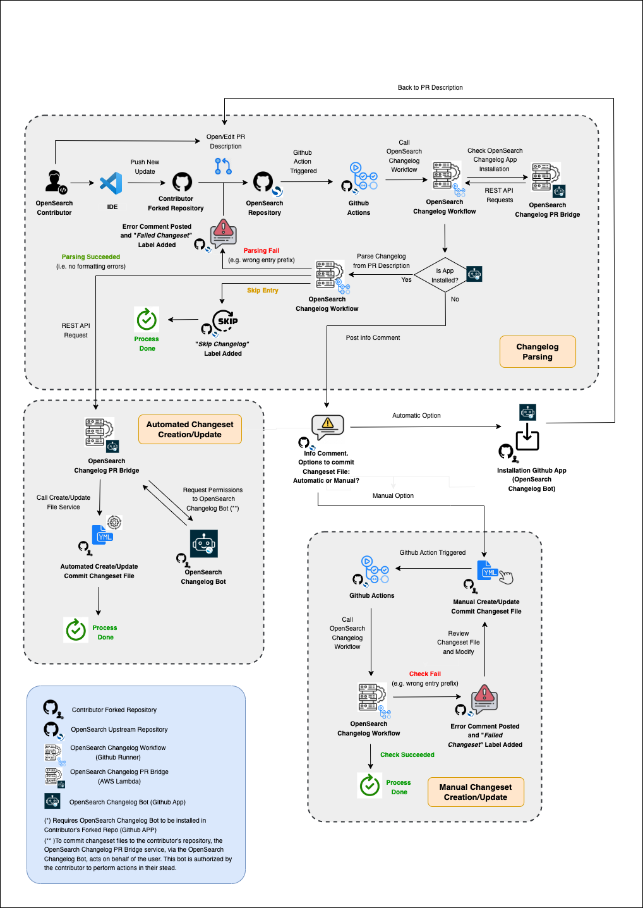
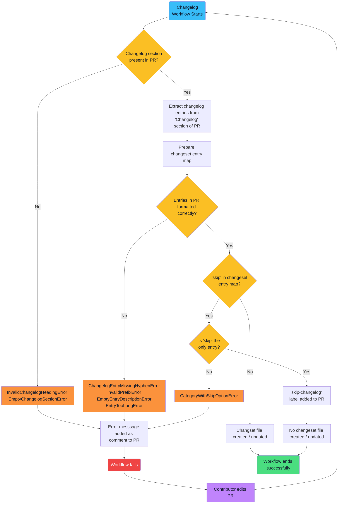

<a name="back-to-top"></a>

<!-- prettier-ignore-start -->
<!-- omit in toc -->
# OpenSearch Automated Changelog and Release Notes Process
<!-- prettier-ignore-end -->


<!-- prettier-ignore-start -->
<!-- omit in toc -->
## Introduction
<!-- prettier-ignore-end -->
This repository contains the source code for a reusable GitHub Action that plays a key role in a broader **Automated Changelog and Release Notes Process** adopted by OpenSearch-Dashboards. Specifically, the Action checks to see that a valid changeset file has been added to pull requests opened against an OpenSearch repository. 

The Action also communicates with a separate GitHub App that contributors can install on their forks in order to create this changeset file automatically and commit it to the open pull request.

This repository also provides templates for a script that can be used to automatically update a changelog and prepare a release notes document when a new version is scheduled for release.

For more details about the GitHub Action, the release notes script, and the **Automated Changelog and Release Notes Process** as a whole, please consult the information below.

<!-- prettier-ignore-start -->
<!-- omit in toc -->
## Table of Contents
<!-- prettier-ignore-end -->

- [Background of the Automated Process](#background-of-the-automated-process)
- [Benefits of the Automated Process](#benefits-of-the-automated-process)
- [Process Overview](#process-overview)
  - [Changelog Process](#changelog-process)
  - [Release Notes Process](#release-notes-process)
- [Getting Started](#getting-started)
  - [Changelog Process](#changelog-process-1)
    - [Creating a New `changelogs` Directory](#creating-a-new-changelogs-directory)
    - [Adding a "Changelog" Section to the PR Description Template](#adding-a-changelog-section-to-the-pr-description-template)
    - [Using a GitHub Actions Workflow to Generate Changeset Files](#using-a-github-actions-workflow-to-generate-changeset-files)
  - [Release Notes Process](#release-notes-process-1)
- [Usage](#usage)
  - [Changelog Process](#changelog-process-2)
    - [Workflow Details](#workflow-details)
    - [Formatting Requirements](#formatting-requirements)
    - [Workflow Flowchart](#workflow-flowchart)
  - [Release Notes Process](#release-notes-process-2)
- [Contributing](#contributing)
- [License](#license)
- [Need Help?](#need-help)

<p align="right">(<a href="#back-to-top">back to top</a>)</p>

## Background of the Automated Process

On March 20, 2023, Josh Romero issued a [call for proposals](https://github.com/opensearch-project/.github/issues/148) that would "solve the entire collection of issues around generating both ongoing CHANGELOGs, and release notes during General Availability (GA) of the product, for all OpenSearch project repositories."

On May 4, 2023, a working group voted unanimously to move forward with the "Automation" variation of [Ashwin Chandran's proposal](https://github.com/opensearch-project/.github/issues/156). This proposal has now been implemented, and the details of the new changelog and release notes process are set out below.

<p align="right">(<a href="#back-to-top">back to top</a>)</p>

## Benefits of the Automated Process

The **Automated Changelog and Release Notes Process** improves both contributor experience as well as the efficiency of product development and the release of new versions.

Before this automated process was adopted, whenever a contributor opened a new PR, they were prompted to indicate whether or not they had manually added an entry to the CHANGELOG.md file. However, since a changelog entry required a PR number as a reference, contributors had to first open a PR first, grab the PR number, and then add a second commit to their open PR with the changelog entry for their changes.

In addition to being inefficient, this two-step process also created an opportunity for merge conflicts. If two or more contributors updated the CHANGELOG.md file in their PRs, and those updates were not synchronized with one another, the order of entries in the changelog would be inaccurate, requiring manual intervention to sort things out.

Likewise, when a new product version was scheduled for GA release, release notes and changelog updates had to be prepared manually. This process was both time consuming and labor intensive.

Automating the changelog and release notes process resolves these complications, giving valuable time back to contributors and maintainers and improving the overall experience of working in OpenSearch's repositories.

<p align="right">(<a href="#back-to-top">back to top</a>)</p>

## Process Overview

The **Changelog and Release Notes Process** act in two separate and independent compartments: (1) the first one, the **Changelog Process**, (2) and the second, the **Release Notes Process**. Details of both of them are introduced in the following subsections.

### Changelog Process

A complete flow diagram from the entire **Changelog Process** is depicted in the figure below.



In the diagram, two GitHub Repositories, two External Services, and one GitHub App conform the core functionality of this automated subprocess.

- **Github Repositories**
  - **OpenSearch Upstream Repository** → base repository of an OpenSearch library where a contributor opens a PR (e.g. [OpenSearch Dashboards](https://github.com/opensearch-project/OpenSearch-Dashboards), [OpenSearch UI Framework](https://github.com/opensearch-project/oui), [OpenSearch Neural Search](https://github.com/opensearch-project/neural-search), etc).
  - **Contributor Forked Repository** → forked repository of an upstream OpenSearch library where a contributor suggests changes by opening a PR.
- **External Services**
  - **OpenSearch Changelog Workflow** → GitHub reusable workflow triggered upon the creation or edit of a PR. Acts only in the **OpenSearch Upstream Repository** and it is in charge of:
    1. Check and parse entries in changelog section of PR description.
    2. Post comments and add or remove labels in PR.
    3. Communicate with **OpenSearch Changelog PR Bridge** for automatic creation/update of chnageset files.
    4. Check format for manual creation or update of changeset files.

  - **OpenSearch Changelog PR Bridge** → Express.js application for **OpenSearch Changelog Bot**. In charge of committing changeset files when automatic option is selected. Acts only in **Contributor Forked Repository** and required **OpenSearch Changelog Bot** app installed. More details in [here](https://github.com/BigSamu/OpenSearch_Changeset_Bot).
- **GitHub App**
  - **OpenSearch Changelog Bot** → GitHub App required for getting contributor's permissions to act on his behalf when committing changeset files on his forked repository. Installed in **Contributor Forked Repository** and used only for automatic approach for creating or updating changeset files. Installation link [here](https://github.com/apps/opensearch-changeset-bot).

As illustrated in the diagram presented three main jobs encompass the interaction of the elements described before:

- **Changelog Parsing** → this first job parses the changelog section of the PR description. The job checks if the **OpenSearch Changelog Bot** is installed in the **Contributor Forked Repository**. If that is the case, an automatic approach is followed to create a changeset file. If not, then a manual one is used instead.

  The result of the parsing action  - supposing that an automatic approach is followed - can consist of three outputs:

  1. **Parsing Failed** → entry parsing in changelog section of PR description fails due to a formatting error. For instance, a wrong entry prefix (i.e., `- tes`` instead of `- test`). More details at [SECTION](link)
  2. **Parsing Succeeded** → parsing is successful and **Automatic Changeset Creation/Update** job is initiated.
  3. **Skip Entry** → a skip entry is found in changelog section (i.e.,` skip`). No changeset is required. The end of the entire process is reached.

- **Automatic Changeset Creation/Update** → This second job is initiated after a successful parsing of the changelog section. The **OpenSearch Changelog PR Bridge** service is called, and it retrieves permissions granted by a contributor - through **OpenSearch Changelog Bot** - for the automatic creation or update of changeset files.
- **Manual Changeset Creation/Update** → This third job is an alternative to the second one if the **OpenSearch Changelog Bot** app is not installed in the contributor's repo. In this case, the contributor must manually add or edit changeset files. After each commit of these files, the **OpenSearch Changelog Workflow** is called to check the internal formatting of the changeset files. In this case, the procedure has two outputs: **Parsing Failed**, and **Parsing Succeeded**. Each logic is the same as for the **Changelog Parsing** job.


---

¿REQUIRED BY JONNATHON DESCRIPTION BELOW?

1. Creating a new `changelogs` directory in the root folder of the repository.

2. Adding a "Changelog" section to the PR template, with instructions for how contributors can add valid changelog entries to this section.

3. Using a GitHub Actions workflow to extract entries from the "Changelog" section of each PR description, create or update a changeset file in `.yml` format, and add this file to the new `changelogs/fragments` directory. The generated changeset file is automatically included as part of the changes to be merged when the PR is approved.


### Release Notes Process

[COMPLETE RILEY AND WILL]

Implementing a script that, when manually triggered from the command line upon general availability of a new product version, will cull the `changelogs/fragments` directory for changeset files and use those files to populate the release notes for the new version and update the final changelog.

<p align="right">(<a href="#back-to-top">back to top</a>)</p>

## Getting Started

This section discusses in greater detail the four primary changes listed in the "[Process Overview](#process-overview)" section above.

### Changelog Process

#### Creating a New `changelogs` Directory

To centralize information pertinent to the new changelog process, a new `changelogs` directory has been added to the root of the repository. This directory is the new location for `CHANGELOG.md`.

It also houses the `fragments` subdirectory, which includes changeset files in `.yml` format that have been generated from merged PRs. (Only one changeset file is generated per PR.)

Changeset files are named with the PR number they correspond to. (E.g., `5218.yml`.)

<p align="right">(<a href="#back-to-top">back to top</a>)</p>

#### Adding a "Changelog" Section to the PR Description Template

The PR template has been updated with a new "Changelog" section. The comment block in this section provides contributors with instructions for how to add properly-formatted changelog entries to their PR.

Below are the formatting standards for changelog entries:

- Each entry line must begin with a hyphen (-) in the Markdown source file.
- Contributors must categorize their changes by using one of the following prefixes, followed by a colon.
  - `breaking`
  - `chore`
  - `deprecate`
  - `doc`
  - `feat`
  - `fix`
  - `infra`
  - `refactor`
  - `security`
  - `test`
- If the changes in a PR are minor (e.g., fixing a typo), contributors can enter `- skip` in the "Changelog" section to instruct the workflow not to generate a changeset file.
  - If `-skip` is entered in the "Changelog" section, no other categories or descriptions can be present.
- After the colon, contributors should provide a concise description of their changes. Descriptions must be 50 characters or less.

Below is an example of a valid entry in the "Changelog" section of the PR description. (Contributors can add more than one entry if they are contributing more than one type of change in their PR. They do not need to delete the comment block in this section, although they can. If they leave the comment block, they should ensure that the changelog entries they add to their PR lie _outside_ of the comment block.)

```markdown
## Changelog

<!-- Default comment block giving formatting instructions for changeloo entries -->

- feat: Adds a new feature
- refactor: Improves an existing feature
```

Below are examples of invalid entries:

```
// Including "skip" with another category
- skip
- feat: Adds a new feature
```

```
// Missing a hyphen
feat: Adds a new feature
```

```
// Invalid category prefix
- new: Adds something new
```

```
// Missing description
- feat
```

```
// Description longer than 50 characters
- feat: Adds a new feature that is simply too excellent to be described in 50 characters or less
```

<p align="right">(<a href="#back-to-top">back to top</a>)</p>

#### Using a GitHub Actions Workflow to Generate Changeset Files

Whenever a contributor opens a PR or edits an existing PR, a GitHub Actions workflow is triggered that extracts the metadata from the PR and checks what a contributor has entered in the "Changelog" section of the PR description.

If a contributor has entered valid changelog entries (see formatting requirements in previous section above), the workflow will categorize these entries and either create or update a `.yml` changeset file in the `changelogs/fragments` directory of the repository.

This changeset file will include changelog descriptions under their proper category and also add a link to the PR that generated these changes. Below is an example of what the contents of a changeset file will look like:

```yaml
feat:
  - Adds a new feature ([#532](https://github.com/.../pull/532))

refactor:
  - Improves an existing feature ([#532](https://github.com/.../pull/532))

test:
  - Add unit testing to new feature ([#532](https://github.com/.../pull/532))
  - Update unit testing for existing feature ([#532](https://github.com/.../pull/532))
```

This changeset file will become part of the code that is merged when the PR is approved.

If the workflow encounters a `- skip` line in the PR, and there are no other changelog entries present, it will skip the creation of a changeset file, and the workflow will terminate successfully.

If the workflow encounters an error (e.g., an empty "Changelog" section or an invalid changelog entry), it will fail, and a custom error message will be printed to the workflow logs and added as a comment to the open PR explaining the reason for the failure.

Contributors can then address the error and update their PR, which will trigger the workflow to run again.

### Release Notes Process

[COMPLETE RILEY AND WILL]

## Usage

### Changelog Process

Here's an example of how to use this action in a workflow file:

```yaml
name: Create Change Set

on:
  pull_request:
    types: [synchronize, opened, edited]
    paths-ignore:
      - "changelogs/fragments/**/*"

jobs:
  update-changelog:
    runs-on: ubuntu-latest
    steps:
      - name: Check out repository
        uses: actions/checkout@v4
      - name: Update Changelog
        uses: BigSamu/OpenSearch_Change_Set_Create_Action@main
        with:
          token: ${{ secrets.GITHUB_TOKEN }}
          changeset_path: changelogs/fragments
```

#### Workflow Details

Whenever a PR is opened or edited in an OpenSearch repository, this workflow is triggered.

The workflow extracts the metadata from the PR and checks what a contributor has entered in the "Changelog" section of the PR description.

If a contributor has entered valid changelog entries (see formatting requirements below), the workflow will categorize these entries and either create or update a `.yml` changeset file in the `changelogs/fragments` directory of the repository.

This changeset file will include changelog descriptions under their proper category and also add a link to the PR that generated these changes. Below is an example of what the contents of a changeset file will look like:

```yaml
feat:
  - Adds a new feature ([#532](https://github.com/.../pull/532))

refactor:
  - Improves an existing feature ([#532](https://github.com/.../pull/532))

test:
  - Add unit testing to new feature ([#532](https://github.com/.../pull/532))
  - Update unit testing for existing feature ([#532](https://github.com/.../pull/532))
```

This changeset file will become part of the code that is merged when the PR is approved.

If the workflow encounters an error, it will fail, and a custom error message will be printed to the workflow logs explaining the reason for the failure.

Contributors can then address the error and update their PR, which will trigger the workflow to run again.

#### Formatting Requirements

In order for the workflow to successfully create or update a changeset file from a PR description, contributors will need to ensure that their entries in the "Changelog" section of the PR description adhere to the following formatting requirements:

- Each entry line must begin with a hyphen (-) in the Markdown source file.
- Contributors must categorize their changes by using one of the following prefixes, followed by a colon.
  - `breaking`
  - `chore`
  - `deprecate`
  - `doc`
  - `feat`
  - `fix`
  - `infra`
  - `refactor`
  - `test`
  - `security`
- If the changes in a PR are minor (e.g., fixing a typo), contributors can enter `- skip` in the "Changelog" section to instruct the workflow not to generate a changeset file.
  - If `-skip` is entered in the "Changelog" section, no other categories or descriptions can be present.
- After the colon, contributors should provide a concise description of their changes. Descriptions must be 50 characters or less.

Below is an example of a valid entry in the "Changelog" section of the PR description. (Contributors can add more than one entry if they are contributing more than one type of change in their PR.)

```
- feat: Adds a new feature
- refactor: Improves an existing feature
```

Below are examples of invalid entries:

```
// Including "skip" with another category
- skip
- feat: Adds a new feature
```

```
// Missing a hyphen
feat: Adds a new feature
```

```
// Invalid category prefix
- new: Adds something new
```

```
// Missing description
- feat
```

```
// Description longer than 50 characters
- feat: Adds a new feature that is simply too excellent to be described in 50 characters or less
```

#### Workflow Flowchart

The following flow chart, built using [Mermaid](https://mermaid.js.org/) syntax, illustrates the logic this workflow follows.

(NOTE: If you are viewing this README in an IDE or code editor, the flow chart will not render. To view the chart, please visit this README file on GitHub's website, which includes built-in support for Mermaid syntax.)



<p align="right">(<a href="#back-to-top">back to top</a>)</p>

### Release Notes Process

[COMPLETE RILEY AND WILL]

When a new product release is ready for general availability, OpenSearch maintainers can run the following script command from the command line:

```bash
yarn release_note:generate
```

This command executes a script that performs the following actions:

- Extract information from the changeset files in the `changelogs/fragments` directory
- Map the changelog entries in these files to their appropriate changelog section headings
- Generate the changelog section for the new release and add it to the top of the changelog
- Create a release notes document to accompany the new release
- Del**ete the ch**angeset files from the `changelogs/fragments` directory

<p align="right">(<a href="#back-to-top">back to top</a>)</p>

## Contributing

This automated process for generating changelog entries and release notes is the result of a concerted effort on the part of OpenSearch maintainers and contributors to improve the development experience for all involved. If you have any suggestions for how we might improve this process, please let us know!

Add Link Developer Guide

<p align="right">(<a href="#back-to-top">back to top</a>)</p>

## License

This project is licensed under the [MIT License](./LICENSE.txt).

## Need Help?
