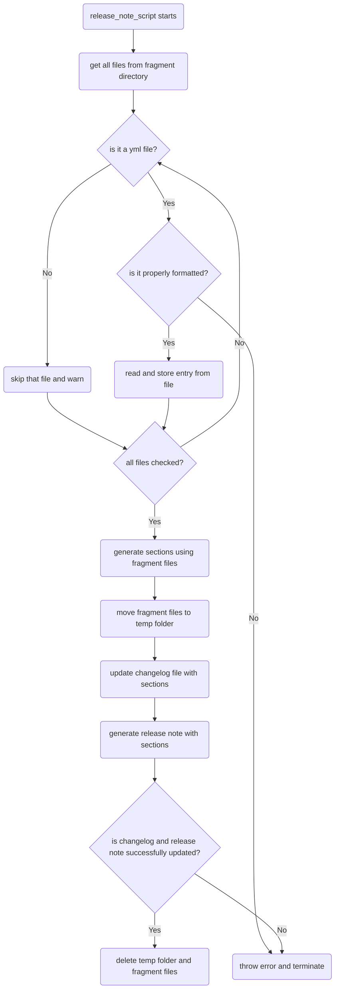

# Overview
This is a template of script that automates the release note generation process. Running the script will:
 - Extract information from the changeset files in the `changelogs/fragments` directory
 - Perform basic validations to ensure proper fragment format
 - Map the changelog entries in these files to their appropriate changelog section headings
 - Generate the changelog section for the new release and add it to the top of the changelog
 - Create a release notes document to accompany the new release
 - Delete the changeset files from the `changelogs/fragments` directory

When a new product release is ready for general availability, OpenSearch maintainers can run the following script command from the command line:
```bash
 yarn release_note:generate
```

# Workflow Flowchart

The following flow chart, built using [Mermaid](https://mermaid.js.org/) syntax, illustrates the logic this workflow follows.

(NOTE: If you are viewing this README in an IDE or code editor, the flow chart will not render. To view the chart, please visit this README file on GitHub's website, which includes built-in support for Mermaid syntax.)


# Using the Script in Your Own Repository

Make sure you have your changeset files under the `changelogs/fragments` directory ready before using the script.

To use the Release-note script, you will need to set it up in your own repository. Here is an [example PR](https://github.com/MadaniKK/OpenSearch-Dashboards/pull/3/files) setting the script up in [Opensearch-Dashboards](https://github.com/opensearch-project/OpenSearch-Dashboards)

## Here is a step-by-step walk through

1. Modify `package.json`
   add this line at the end of `"scripts":{ }`
   ```json
    "release_note:generate": "scripts/use_node scripts/ generate_release_note"
   ```
2. Add `generate_release_note.ts` and `generate_release_note.ts` to `./src/dev` directory

3. Add `generate_release_note.js` to `./scripts` directory

4. To run the script, open the terminal and run:
   ```bash
    yarn release_note:generate
   ```
   
# Modifying the script
Should you wish to modify the script for your repository. It is pretty straightforward. Below are some common areas to look:
- change file paths & locations --> modify the const paths in generate_release_note_helper.ts
    ```typescript
    export const filePath = ...
    export const fragmentDirPath = ...
    export const fragmentTempDirPath = ...
    export const releaseNotesDirPath = ...
    ```
- change section names --. modify the const SECTION_MAPPING in generate_release_note_helper.ts
    ```typescript
    export const SECTION_MAPPING = ...
    ```
- change max entry length or other validation criteria --> modify const MAX_ENTRY_LENGTH or validateFragment function in generate_release_note_helper.ts
    ```typescript
    const MAX_ENTRY_LENGTH = ...
    ```
    ```typescript
    export function validateFragment(content: string) {
        ...
        const entryRegex = ...
        ...
    }
    ```
